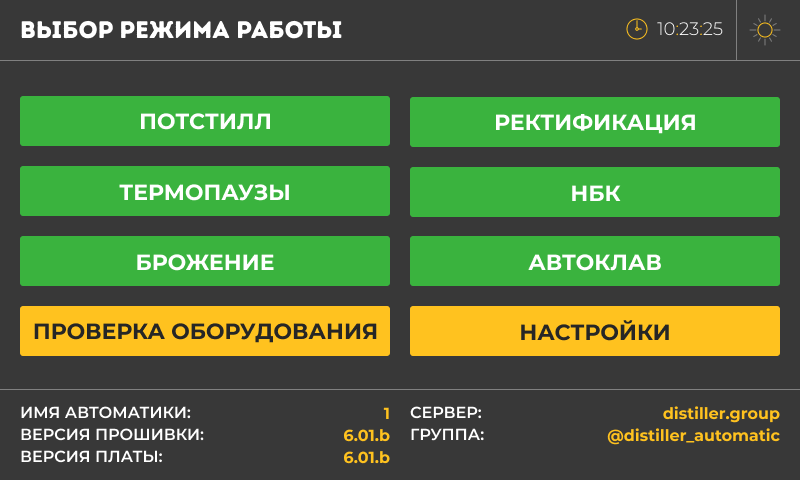

### Главное меню

{width=800px height=480px}

#### Подсветка экрана

-  В правом верхнем углу вы можете настроить яркость экрана.

-  Выберите один из трех уровней яркости: **низкий** , **средний** , **высокий**

***Примечание:*** Если вы работаете в темноте, лучше выбрать высокую яркость, чтобы было удобно видеть информацию на экране.

#### Выбор режима работы

Все режимы работы реализованы в виде отдельных программ, которые используют как общие настройки, так и индивидуальные

Distiller автоматизирует основные технологические процессы, включая:

1. **Дистилляция**

   -  **Потстилл:** Простая прямоточная перегонка для получения классического самогона

   -  **Дробная:** Разделение на фракции (головы, тело, хвосты) для чистого продукта

2. **Ректификация**\
   Получение спирта высокой крепости (до 97%) за счёт многоступенчатой очистки

3. **Термопаузы**

   -  **Затирание:** Нагрев сусла до нужной температуры для приготовления затора

   -  **Кипячение:** Варка сусла с добавками для создания пива или других напитков

4. **Автоклав**\
   Приготовления продуктов и консервов, а так же стерилизация оборудования в режимах работы на воде и на пару

5. **Брожение**

   -  **Бродильные ёмкости:** Поддержание температуры для активного брожения

   -  **ЦКТ:** Точный контроль температуры в профессиональных ёмкостях

6. **НБК (непрерывная бражная колонна)**\
   Автоматическая перегонка браги в спирт сырец без остановки процесса

#### Проверка оборудования

Проверка оборудования производится в любое время и вне запущенного режима работы. Вы можете видеть состояние всех подключённых устройств.

#### Общие настройки

Отображение присвоенного номера платы (имени), а так же общая информация о текущей версии микропрограммы главной платы и экрана.

#### 

#### 