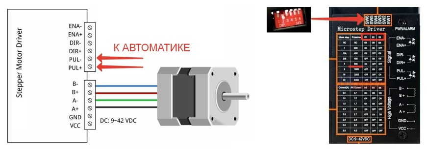
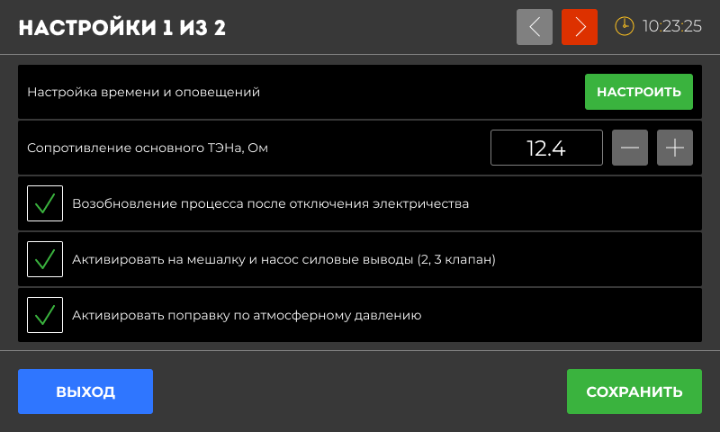

### Введение

Перед началом работы с автоматикой Distiller важно правильно настроить устройство. Это поможет вам получить качественный дистиллят и обеспечит безопасную работу устройства.

### Настройки времени и оповещений

#### Настройка времени

Правильное время важно для корректной работы таймеров и записи данных, а также для отображения графиков и статистики на сайте.

-  Убедитесь, что время на вашем устройстве установлено правильно.

-  Нажмите на пункт **«Настройка времени и оповещений**» и установите текущее время с помощью кнопок «+» и «-».

#### Громкость звука

-  Активировать 10-секундное уведомление при ошибке и завершении: если вы не отключите уведомление вручную, оно прекратится через 10 секунд автоматически.

-  Отключить звуки: все звуковые оповещения отключены, даже аварийные.

### Поле «Сопротивление основного ТЭН, Ом»

Чтобы на экране корректно отображалась мощность (в ваттах), которую выдаёт ТЭН. Это зависит от напряжения в сети и сопротивления самого ТЭНа. Автоматика показывает реальную мощность, которую ТЭН может выдать при текущем напряжении.

**Инструкция по измерению сопротивления мультиметром**:

-  Отключите ТЭН от сети.

-  Установите мультиметр в режим измерения сопротивления (Ω).

-  Подключите щупы мультиметра к контактам ТЭНа.

-  Считайте значение на экране мультиметра.

-  Введите полученное значение в поле ввода

*Примечание: Если не уверены -- используйте таблицу.*

**Рекомендуемое значение**:

| **Мощность ТЭНа (кВт)** | **Предполагаемое сопротивление (Ом)** |
|-------------------------|---------------------------------------|
| **1\.0**                | **48\.4**                             |
| **1\.5**                | **32\.3**                             |
| **2\.0**                | **24\.2**                             |
| **2\.5**                | **19\.4**                             |
| **3\.0**                | **16\.1**                             |
| **3\.5**                | **13\.8**                             |
| **4\.0**                | **12\.1**                             |
| **4\.5**                | **10\.8**                             |
| **5\.0**                | **9\.7**                              |
| **5\.5**                | **8\.8**                              |
| **6\.0**                | **8\.1**                              |

**Формула для расчёта**

Для точного расчета сопротивления вашего ТЭНа воспользуйтесь формулой. Рекомендуем измерять каждую нитку отдельно и складывать вместе, после чего подставлять в формулу Р

[image:./clip_image001.png:::0,0,100,100:55::426px:45px]

*Примечание:* Если сопротивление указано верно, но мощность на экране отображается  некорректно, то вы можете подобрать корректное значение, через подбор значения сопротивления или прошивки Dimmer другого поминала.

### **Возобновление процесса после отключения электричества**

Активация настройки позволяет устройству продолжить работу с того места, где оно остановилось, после восстановления питания или зависанию процессора из за электромагнитных наводок.

*Примечание:* недоступен для программы Ректификация. После включения автоматики режим нужно будет восстанавливать  и перезапустить самостоятельно.

### Активировать на мешалку и насос силовые выводы (2, 3 клапан)

-  Если **галочка стоит** , то клапаны К2 и К3 будут работать как силовые выводы (220В) для управления мешалкой (К2) и насосом (К3), согласно указанной пользователем программе.

-  Если **галочка снята** , К2 и К3 используются для управления клапанами и для управления приборами используется “**Сухой контакт СПЧ 1 и СПЧ 2”.** Управление происходит через частотный преобразователем или контактор.

*Примечание:* “Сухой контакт СПЧ 1 и СПЧ 2” активен всегда вне зависимости от настроек и выбранных режимов работы.

### Активировать поправку по атмосферному давлению

Давление воздуха влияет на температуру кипения жидкости. Чтобы показания температуры были точными, автоматика Distiller учитывает атмосферное давление и автоматически вносит поправки.

### Калибровка датчиков температуры

Калибровка датчиков температуры нужна, чтобы показания были точными. Если вы заметили, что температура на экране отличается от реальной, выполните калибровку. Отрегулируйте значение с помощью кнопок «+» или «-» на экране.

*Примечание:* калибровка происходит в горячей воде выше 90С. Опустите датчики на 2-3 минуты вместе с контрольным спиртовым термометром. Калибровка в кипящей воде не рекомендуется, т.к. пузырьки воздуха могут влиять корректность измерения.

### Перистальтический насос

Перистальтический насос (с шаговым двигателем) используется для дозированного налива, подачи браги в непрерывную бражную колонну, а так же отбора голов и тела в ректификации. Для правильной работы насоса необходима его калибровка. Автоматика управляет насосом сама, подавая на выход необходимую частоту для вращения двигателя.

Перистальтический насос состоит из головы которая перекачивает жидкость, драйвера двигателя и блока питания, схема такого устройства представлена ниже.

{width=871px height=307px}

В автоматике подключается к первому сверху справа платы разъему (+ находится вверху).

На драйвере шагового двигателя есть мини переключатели, так же на нем располагается таблица где указано число шагов в зависимости от позиций этих выключателей, это число необходимо выставить в автоматике в пункте (**количество шагов на оборот двигателя**) и нажать кнопку сохранить.

#### Калибровка насоса

{width=800px height=480px}

При настройке его нужно налить тестовый объём для замера, нажать кнопку **“Старт”**. Насос должен сливать жидкость в мерную колбу. При этом вся система трубки должна быть заполнена жидкостью. В следующее поле мы вводим полученный объём после завершения замера. Далее вводится количество шагов на оборот двигателя. Количество шагов берётся с драйвера шагового двигателя. В зависимости от того, как там расположены перемычки, есть 200, 400, 800, 1600 шагов и так далее. Также в этом меню можно налить заданный объём, для этого выставляется заданный объём и нажимается кнопка **“Налить”** после налива насос останавливается и последний пункт в этом меню это скорость налива литров в час, то есть с какой скоростью будет производиться налив.

### Датчики уровня и разлития

#### Датчик разлития

Активирует порт датчика и определяет чувствительность срабатывания. Обычно изменение данного параметра не требуется, только в случаи ложных срабатываний. Рекомендуется выставлять данный параметр 900 единиц и ниже.

#### Чувствительность (для всех датчиков)

Настройка чувствительности датчиков помогает избежать ложных срабатываний (например, из-за влажности) и обеспечивает точную работу устройства.

Какие датчики настраиваются?

-  Электродные датчики уровня (работают через два электрода). Для настройки опустите датчик в жидкость (например, в воду). Посмотрите, какие показания он выдаёт (например, 50–100 ). Установите чувствительность чуть выше этих значений (например, 150–200 ). Если чувствительность слишком высокая, возможны ложные срабатывания.

-  Поплавковые датчики (с герконом -- простое замыкание цепи). Эти датчики работают как простое замыкание цепи. Когда поплавок поднимается, датчик показывает 0 или 1 (замыкание). Никаких дополнительных настроек чувствительности для них не требуется.

*Примечание:* когда датчик сухой (не мокрый), его показания обычно около 1000. Если чувствительность выставлена правильно, датчик будет точно реагировать только на жидкость, а не на влажность или другие факторы.

#### **Показания датчика уровня 1 и 2**

Калибровочным датчиком является первый датчик уровня (третий разъем сверху, с правой стороны платы), он показывает текущие показания датчика. То есть подключается к данному разъему или датчик уровня или датчик разлития, далее инициируем срабатывание. К высвеченной цифре добавляем 100-200 единиц и выставляем это значение.

### Предел датчика давления, PSI

Чтобы давление на экране показывалось корректно, то есть пересчитывалось в миллиметры ртутного столба, необходимо указывать текущий наминал датчика давления PSI. По умолчанию выставлено 5 PSI. Если куплен другой датчик, например, 10PSI,  25 PSI, то указывается  наминал установленного у вас датчика давления. Для датчиков с началом измерения 0 вольт выставляется галочка “**Мин. выход 0 вольт**“. Определить, что у вас именно такой датчик давления можно по отрицательному значению давления на главном экране режима.

*Примечание:* 1PSI=51.7149мм рт. ст. Рекомендуем использовать датчики 0-5PSI. Например, для датчика с диапазоном **5 PSI** максимальное значение будет 259 мм рт. ст.

### Текущее напряжение в сети, Вольт

Калибровка показателей напряжения сети. Измерьте мультиметром напряжение в розетки к которой подключен блок автоматики и если есть расхождения с отображаемыми в поле значениями, то произведите корректировку.

*Примечание:* Не требует корректировки без необходимости и перед каждым использованием.

### Датчик перегрева радиатора нормально закрыт

Датчик перегрева радиатора случит для отключение нагрузки в случае перегрева. Настраивается при изготовлении и не требует корректировки.

*Примечание: Некорректно выставленное значение будет вызывать ошибку “Перегрев радиатора свыше 80С“*