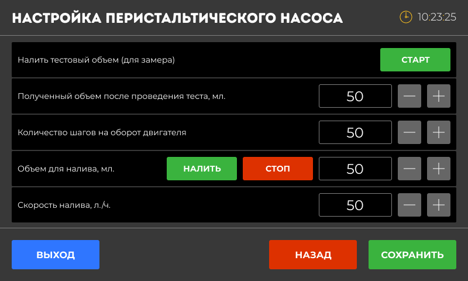

### Введение

Перед началом работы с автоматикой Distiller важно правильно настроить устройство. Это поможет вам получить качественный дистиллят и обеспечит безопасную работу устройства.

### Настройки времени и оповещений

#### Настройка времени

-  Убедитесь, что время на вашем устройстве установлено правильно.

-  Нажмите на пункт **«Настройка времени и оповещений**» и установите текущее время с помощью кнопок «+» и «-».

*Примечание:* Правильное время важно для корректной работы таймеров и записи данных.

#### Громкость звука

-  Активировать 10-секундное уведомление при ошибке и завершении: если вы не отключите уведомление вручную, оно прекратится через 10 секунд автоматически.

-  Отключить звуки: все звуковые оповещения отключены, даже аварийные.

### Поле «Сопротивление основного ТЭН, Ом»

Укажите сопротивление вашего ТЭН для точного расчёта мощности в ваттах.

**Инструкция по измерению сопротивления мультиметром**:

-  Отключите ТЭН от сети.

-  Установите мультиметр в режим измерения сопротивления (Ω).

-  Подключите щупы мультиметра к контактам ТЭНа.

-  Считайте значение на экране мультиметра.

-  Введите полученное значение в поле ввода

*Примечание: Если не уверены -- используйте таблицу.*

**Рекомендуемое значение**:

| **Мощность (кВт)** | **Сопротивление (Ом)** |
|--------------------|------------------------|
| 1\.0               | 48\.4                  |
| 1\.5               | 32\.3                  |
| 2\.0               | 24\.2                  |
| 3\.0               | 16\.1                  |
| 4\.5               | 10\.7                  |
| 6\.0               | 8\.1                   |

**Формула для расчёта** (если ваш ТЭН другой):

### **Возобновление процесса после отключения электричества**

Активация настройки позволяет устройству продолжить работу с того места, где оно остановилось, после восстановления питания или зависанию процессора из за электромагнитных наводок.

*Примечание:* недоступен для программы Ректификация. После включения автоматики режим нужно будет восстанавливать  и перезапустить самостоятельно.

### Активировать на мешалку и насос силовые выводы (2, 3 клапан)

-  Если **галочка стоит** , то клапаны К2 и К3 будут работать как **силовые выводы** для управления мешалкой и насосом.

-  Если **галочка снята** , то СПЧ 1 и СПЧ 2 будут работать как **сухие контакты** для управления частотным преобразователем.

### Активировать поправку по атмосферному давлению

Давление воздуха влияет на температуру кипения жидкости. Чтобы показания температуры были точными, автоматика Distiller учитывает атмосферное давление и автоматически вносит поправки.

### Калибровка датчиков температуры

Калибровка датчиков температуры нужна, чтобы показания были точными. Если вы заметили, что температура на экране отличается от реальной, выполните калибровку. Отрегулируйте значение с помощью кнопок «+» или «-» на экране.

*Примечание:* калибровка происходит в горячей воде выше 90С. Опустите датчики на 2-3 минуты вместе с контрольным спиртовым термометром. Калибровка в кипящей воде не рекомендуется, т.к. пузырьки воздуха могут влиять корректность измерения.

### Перистальтический насос

{width=800px height=480px}

### Датчики уровня и разлития

### Предел датчика давления (1PSI, 51.7 мм. рт. ст.), PSI