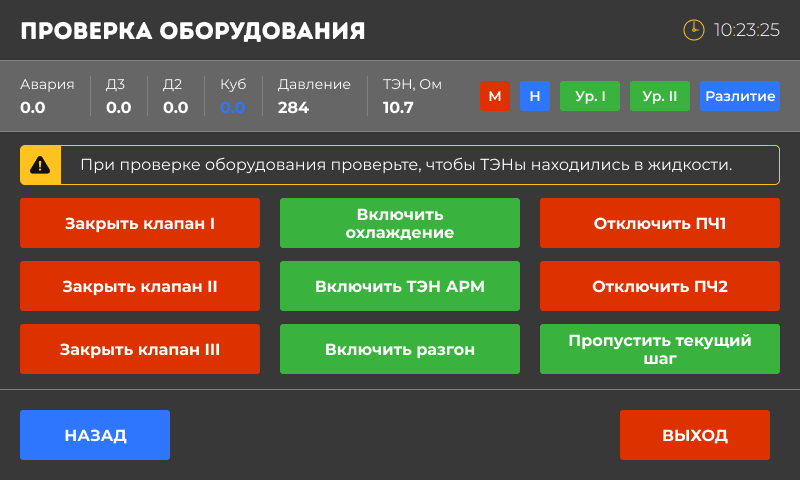

{width=800px height=480px}

Общий и работающий вне режимов - с главного экрана

В данном меню происходит проверка работоспособности всех подключенных устройств, клапанов и датчиков, как перед началом работы. При выходе из данного пункта меню, все действия пользователя будут отменены и состояния устройств вернуться к тем, что были до их изменения.

*Примечание:* при запуске ТЭН АРМ происходит проверка работоспособности силового реле и симистора. На клемник подается мощность 0%. При нормальной работе устройства реле издаст характерный щелчок, а на выходе клемника ТЭН АРМ будет 0В. Если на клемнике 220В, то вероятно симистор неисправен.

