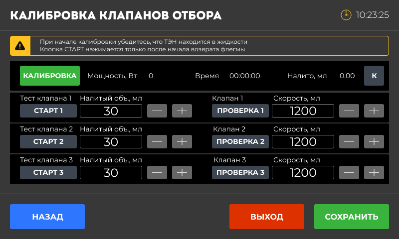

Калибровка клапанов необходима для точного отбора жидкости в миллилитрах.

Данный процесс существует в рамках процесса “Ректификация“ и берет настройки из настроек этого режима. Экран калибровки клапанов представлен ниже.

{width=800px height=480px}

Экран состоит из двух основных областей: область запуска и контроля процесса и область ввода значений и проверки корректности выставленных значений.

1. **Подготовка:**

   -  ……

   -  …….

   -  …..

   -  Убедитесь, что колонна работает «на себя» минимум 30 минут.

   -  Проверьте давление и температуру -- они должны быть стабильными.

2. **Вход в режим калибровки:**

   -  Перейдите в режим «Безопасность».

   -  Откройте экран «Калибровка клапанов».

3. **Калибровка клапана 1/2/3:**

   -  Выберите клапан для калибровки.

   -  Откройте клапан на нажав кнопку “СТАРТ” и измерьте объем жидкости (в мл).

   -  Введите измеренный объем в соответствующее поле.

   -  Повторите для всех трех клапанов (при их наличии).

4. **Сохранение и проверка:**

   -  Сохраните результаты калибровки.

   -  Проведите тестовый отбор, чтобы убедиться в точности. Для этого введите количество жидкости для отбора. Соберите жидкость в мерной колбе и удостоверьтесь в точности. Если точность не удовлетворяет, то повторите калибровку клапана повторно.

### Коэффициенты

На разных скоростях подачи жидкости могут возникать погрешности в расчётах отобранного объёма. Чтобы минимизировать эти погрешности, мы ввели специальные **коэффициенты** , которые помогают точнее настроить процесс.

#### **Как это работает?**

-  Если вы выставили определённую скорость (например, 3 литра в час), но фактический объём отличается (например, 2500 мл или 3200 мл), нужно подкорректировать коэффициент.

-  **Коэффициент** -- это значение, которое влияет на точность работы насоса. Его можно уменьшать или увеличивать для достижения нужного результата.

#### **Как подобрать коэффициент?**

1. **Если льёт больше, чем нужно:**

   -  Например, вы выставили 3 литра в час, а устройство наливает 3200 мл.

   -  В этом случае **увеличьте коэффициент** (добавьте к текущему значению, например, +0.2, +0.4 и т.д.).

   -  Увеличение коэффициента снижает скорость подачи жидкости.

2. **Если льёт меньше, чем нужно:**

   -  Например, вы выставили 3 литра в час, а устройство наливает только 2500 мл.

   -  В этом случае **уменьшите коэффициент** (отнимите от текущего значения, например, -0.2, -0.4 и т.д.).

   -  Уменьшение коэффициента увеличивает скорость подачи жидкости.

3. **Метод подбора:**

   -  Меняйте коэффициент небольшими шагами (например, ±0.2, ±0.4).

   -  После каждого изменения сразу проверяйте, как изменилась скорость подачи.

   -  Продолжайте корректировку, пока фактический объём не совпадёт с заданным.

#### **Важно помнить:**

-  Подбор коэффициентов выполняется **индивидуально для каждой скорости** .

-  Чем точнее вы настроите коэффициент, тем меньше будет погрешность при работе.

*Всё просто: если льёт больше -- увеличьте коэффициент, если меньше -- уменьшите. Меняйте и проверяйте до идеального результата.*