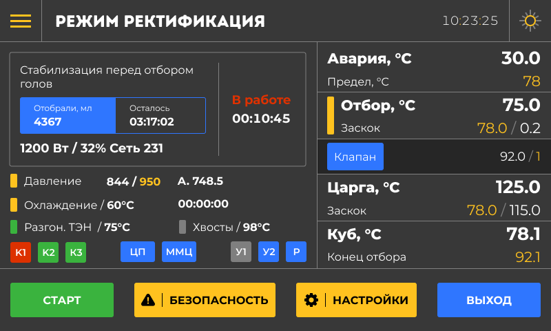

Режим **Ректификация** помогает получить спирт высокой крепости (до 96%) и очистить его от примесей, таких как сивушные масла и альдегиды. Этот режим идеально подходит, если вам нужен максимально чистый продукт. Система автоматически контролирует температуру, давление и подачу воды в дефлегматор, обеспечивая многоступенчатую очистку. Благодаря этому вы можете доверить сложный процесс автоматике и получить отличный результат без лишних усилий.

{width=800px height=480px}

Дашборд

Панель датчиков

Шторка с кнопками