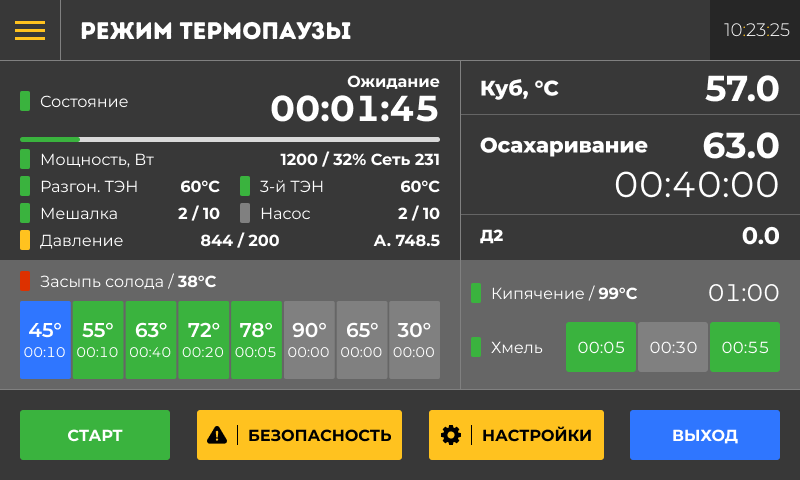

Режим **Термопаузы** для затирания сусла помогает точно контролировать температуру на каждом этапе приготовления затора. Это важно, чтобы ферменты правильно превратили крахмал в сахар, от чего зависит качество будущего напитка. Система автоматически поддерживает нужную температуру и время выдержки для каждой паузы, например, белковой или мальтозной. Вам не нужно постоянно следить за процессом -- устройство само переключится на следующий этап, когда это необходимо.

{width=800px height=480px}

Дашборд

Панель датчиков

Шторка с кнопками